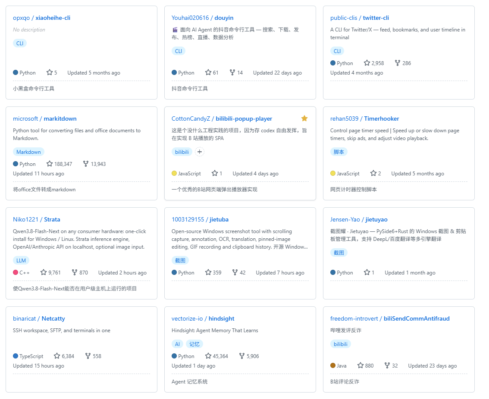

# GithubStarManager

[简体中文](README.md) | English

Turns your GitHub Stars page from a long list into a searchable, filterable, taggable card grid.

It runs as a userscript (Tampermonkey / Violentmonkey) inside GitHub pages and is designed for desktop viewports only; below 768px it stays completely inert and leaves GitHub untouched.

---

## Features

### Card grid

- Converts the list view into a card grid and narrows the left profile sidebar to give repos more room.
- Responsive three-column layout: at ≥1200px you get "profile sidebar (180px) + card grid + Starred Topics"; at 768–1199px only the grid is kept.
- Local pagination, 30 per page, kept in sync with GitHub's native pager. A quick pager is also mounted at the right of the title row (a clone of the native pagination controls), so you don't have to scroll to the bottom mid-page.
- The `N / M` in the pager is clickable and turns into an inline input for jumping to a page (Enter submits, Esc cancels, invalid or out-of-range input is silently ignored).

### Search, filter and sort (all local)

- Search: just use the page's search box. It matches **author / repo name / description / tags / notes**, and matches are highlighted. Language is not part of free-text matching (otherwise `ASC` would hit `JavaScript`) — use the language filter for that.
- Filters: tags, language (multi-select), and type (Public / Private / Sources / Forks / Mirrors / Templates, multi-select). Available options narrow themselves to the current result set.
- Sort: Recently starred / Recently active / Most stars / Most Forks, with ascending/descending toggle.
- Filter state lives in URL parameters, so a refresh or a shared link reproduces the view; `Clear filter` resets everything (keeping the sort order).

### Tags and notes

- Add your own tags (multiple per repo) and a note to any repository.
- Tags and notes are **isolated per GitHub account**; switching accounts never reads someone else's data.
- Clicking a tag adds it to the filter; the Tags menu in the filter bar lists only the tags present in the current result set.

### Sync

- After configuring a token, one full sync writes star membership, star timestamps and repository metadata into a local cache. From then on, rendering, pagination, filtering and search are entirely local — no network.
- Two equivalent entry points: the TM menu item "🔄 立即全量同步（GitHub API）" and the Sync button in the title row. Whichever you use, the state shows on the same button (a spinning icon = running).
- On page load the script does a cheap conditional probe first: if everything is a 304 it exits early at zero quota cost, and only pulls the full table when something changed.
- When changes are detected, the grid re-renders immediately and a change digest is pushed (it only counts unstars / additions / restorations; a pure metadata refresh goes to the console only) — the list and the digest are never out of sync.
- **Integrity rule**: if pagination is interrupted, parsing fails, the page cap is exceeded, or rate-limit headroom is too low, the whole table is abandoned and no data is touched. A half table would flag every repo it failed to fetch as "unstarred".

### Starring, unstarring and restoring

- The star button on each card stars/unstars in place, without leaving the page.
- All write requests run serially with at least a 1-second gap (following GitHub's official best practices — no concurrency, no automatic retries).
- After an unstar, tags and notes are **kept for 24 hours** (grace period). During that window you can restore from the TM menu item "♻️ 恢复已取消的 star（24h 内）"; restoring really calls the remote API, not just a local rollback.
- Clicking the button again while a request is queued cancels that operation (the request is never sent).

### Import / export

- TM menu "📤 导出数据（标签/备注）" exports a single JSON containing only repos that **have tags or a note**.
- "📥 导入数据（标签/备注）" opens a large dialog where you can pick a file or drag a JSON in.
- Merge semantics: tags are unioned, notes from the file win but an empty note never overwrites a non-empty local one, and repository metadata only fills gaps.
- The export contains **no token**, no sync metadata (ETag baselines) and no grace-period backups. It carries a user ID and can only be imported into the same account.
- Import does **not** trigger a sync — writing the data is the whole job; whether to pull from the remote is your call.

### Other users' Stars pages

- You also get a card grid on someone else's Stars page, but the data comes **only from entries already rendered on that page** — no network requests and no storage writes are made for it.
- On those pages: page through with GitHub's native pager, and tags/notes are read from *your* account — repos you have starred are editable in place, the rest are shown read-only (if a repo is currently in your 24-hour grace-period backup, its tags and notes still show, just not editable).
- Star button state on those cards always reflects *your* cache; "they starred it" is never mistaken for "I starred it".

### Miscellaneous

- Narrow viewports (<768px) are completely inert: no styles injected, no nodes created, no page DOM touched, no UI shown, no automatic sync, and no native interaction intercepted. Widen the window and it comes back automatically.
- Breakpoint crossings are handled live in both directions, with no page reload.
- Turbo in-site navigation is supported; round-tripping between your own and someone else's Stars page never leaks data across views.
- A TM menu toggle "🙈 隐藏 Lists 区块" hides the Lists section on profile pages (hidden by default).
- Token ownership check: if the token's account differs from the account currently signed in to the browser, a persistent warning banner appears (warn only, never blocking), so reads and writes don't silently point in opposite directions.

---

## Screenshot



---

## Installation

### Prerequisites

Install a userscript manager first:

- [Tampermonkey](https://www.tampermonkey.net/) (recommended; Chrome / Edge / Firefox / Safari)
- [Violentmonkey](https://violentmonkey.github.io/)

### Install the script

Download `github-star-manager.user.js` from the [project Releases](https://github.com/YsLtr/GithubStarManager/releases), or create a new script in your manager and paste the contents.

### Configure a token

1. Open your GitHub Stars page (`https://github.com/<your-username>?tab=stars`).
2. Click "⭐ 设置 GitHub Token" in the userscript manager menu.
3. Follow the config panel to create a token and paste it in — saving kicks off a full sync automatically.

The panel also offers two pre-filled creation deep links:

| Type | Capability |
|---|---|
| **classic (recommended)** | Can read and write, including starring/unstarring public repos not owned by you. Use the `repo` scope. |
| **fine-grained** | Reads fine; it cannot write stars for public repos not owned by you or your org, in which case writes fall back to the browser's signed-in session. |

The token is stored only in local userscript storage and is never uploaded anywhere (it is not part of export files either).

---

## Usage

| What you want | How to do it |
|---|---|
| Full sync | The Sync button in the title row, or TM menu "🔄 立即全量同步（GitHub API）" |
| Search | The page's search box; type author / repo name / description / tag / note keywords |
| Filter by tag | Click a tag on a card, or use the Tags menu in the filter bar |
| Filter by language / type | The Language / Type menus in the filter bar (multi-select) |
| Sort | The Sort menu in the filter bar, with an ascending/descending toggle |
| Jump to a page | The `N / M` in the pager, or the quick pager at the right of the title row |
| Star / unstar | The star button on the card |
| Restore a star removed in the last 24h | TM menu "♻️ 恢复已取消的 star（24h 内）" |
| Back up tags and notes | TM menu "📤 导出数据（标签/备注）" |
| Restore a backup | TM menu "📥 导入数据（标签/备注）" |
| Hide the profile page Lists section | TM menu "🙈 隐藏 Lists 区块（开/关）" |

> A full grid requires the Stars cache. Without it the script shows setup guidance instead of a half-built grid.

---

## FAQ

### Why is there no grid on my phone or in a narrow window?

The script only activates at viewport widths of 768px and above; narrow viewports keep GitHub's native page with no conversion at all (no styles injected, no nodes created, no notifications). Widen the window and it comes back without a reload.

### Why does someone else's Stars page show only the current page?

The grid on other people's pages only uses entries GitHub has already loaded, and never fetches the remaining pages. That is deliberate: it avoids burning your API quota on someone else's page. Use GitHub's native pagination to go further.

### Do tags and notes sync to GitHub?

No. Tags and notes live in local userscript storage and are isolated per signed-in GitHub account; use export/import to move them. Only star membership, star timestamps and repository metadata come from the remote; tags and notes are always locally authoritative and a sync will never overwrite them.

### Do I lose my tags after unstarring a repo?

No. They are kept for 24 hours, during which the TM menu item "♻️ 恢复已取消的 star（24h 内）" restores the repo with its tags and notes intact. Only after 24 hours are they actually discarded.

### Why does it say my token's account doesn't match?

Because the account that owns the token is not the account your browser is currently signed in as. That may well be intentional (e.g. read with a personal account, write with a work account), so the script only warns and never blocks. If you do want them unified, open the panel and reconfigure the token.

### Why doesn't it use AI to summarize projects in bulk?

AI-written summaries don't necessarily match the note you'd want, and a note you didn't think through yourself is basically worthless — you need to know why *you* starred a project.

### Why a userscript instead of a browser extension?

A userscript can be backed up or migrated together with the userscript manager. A browser extension has to rely on the browser's own sync or its own config sync, which is more painful and hard to carry across different browsers.

### Why not use GitHub Star's built-in Lists?

Lists have a limit of up to 32 items and a maximum of 32 characters for the List name, which makes them rather inadequate, so they are not used. The script hides the Lists section by default; users can unhide it themselves and use the Lists feature normally.

### Where is my data stored?

Only in the userscript manager, under keys prefixed with `stars_`: the repository metadata cache, per-account tags and notes, the 24-hour grace-period backup, sync metadata (ETag baselines and a token-ownership fingerprint), and the token itself. The token is excluded from the localStorage fallback mirror (the sensitive-key list in `gm.ts`), and export files never contain it either. The script has no server of its own and makes no requests beyond the GitHub API.

### Why can't a fine-grained token star repos?

GitHub currently does not allow fine-grained tokens to write stars for public repositories that are neither yours nor your organization's. When the script sees a `github_pat_` prefix it doesn't refuse the configuration — it falls back to the browser's signed-in session for writes (reads are unaffected). See [docs/adr/0004](docs/adr/0004-write-requires-classic-pat.md) and [docs/adr/0006](docs/adr/0006-web-endpoint-write-fallback.md).

---

## Development

```bash
pnpm install
pnpm dev       # local dev server (HMR)
pnpm check     # typecheck + build
pnpm build     # emits dist/github-star-manager.user.js
```

Stack: Vite 8 + [vite-plugin-monkey](https://github.com/lisonge/vite-plugin-monkey) 8 + TypeScript (strict). The build artifact is a single `.user.js` with no runtime dependencies.

Development environment setup (the CSP / Local Network Access prerequisites for HMR on github.com, and the 5-grant constraint) plus architecture notes are in [DEVELOPER.md](DEVELOPER.md) (Chinese); domain terminology in [CONTEXT.md](CONTEXT.md); architecture decisions in [docs/adr/](docs/adr/).

---

## License

[MIT](LICENSE) © YsLtr
